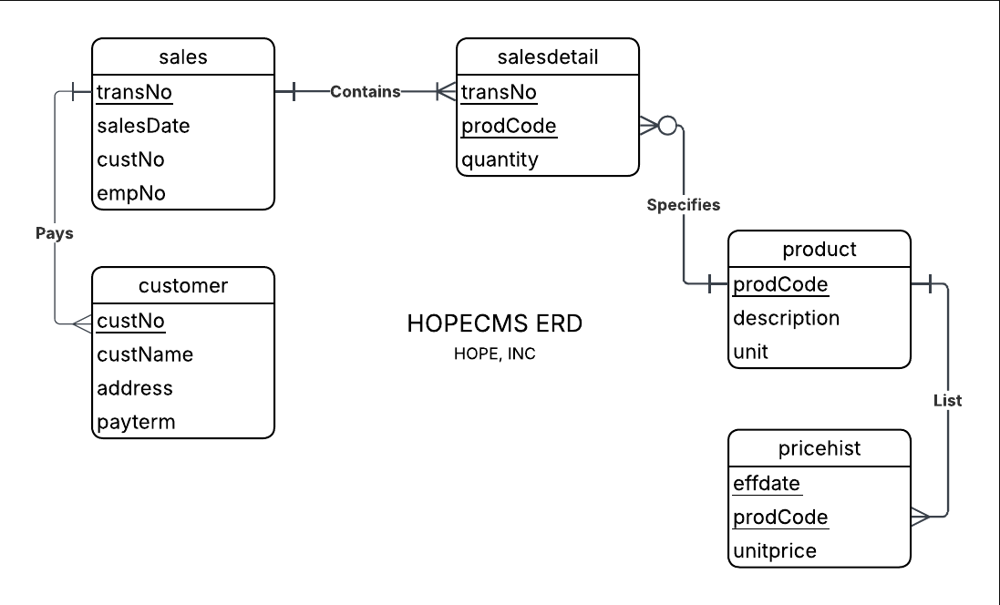

# HOPECMS — Hope Inc. Customer Management System
 
> A web-based Customer Management System built for **Hope, Inc.** to manage customer records, sales transactions, product listings, and pricing history.
 
---
 
## 📐 Entity Relationship Diagram
 


The system is built around the following core entities:
 
- **customer** — stores customer information including name, address, and payment terms
- **sales** — records each sales transaction linked to a customer and employee
- **salesdetail** — line items of each sale, referencing the product and quantity
- **product** — product catalog with description and unit of measure
- **pricehist** — historical pricing records per product with effectivity dates
---
 
## 🛠️ Tech Stack
 
| Layer | Technology |
|---|---|
| Frontend | [React](https://react.dev/) + [Vite](https://vitejs.dev/) |
| Styling | [Tailwind CSS](https://tailwindcss.com/) |
| Backend / Database | [Supabase](https://supabase.com/) (PostgreSQL + Auth + Storage) |
| Language | JavaScript / JSX |
| Package Manager | npm |
| Version Control | Git + GitHub |
 
---
 
## 🚀 Getting Started
 
### Clone the repo
```bash
git clone https://github.com/JomarAuditor/HOPECMS.git
```
 
### Install dependencies
```bash
npm install
```
 
### Environment Setup
- Create a `.env` file in the root directory.
- Copy the keys from the **pinned message in our GC**.
- Ensure your `.env` looks like `.env.example`.
### Run local server
```bash
npm run dev
```
 
---
 
## 📂 Project Structure
 
```
src/
├── pages/        # All CMS module pages (Customers, Sales, etc.)
├── components/   # Reusable UI components and Route Guards
└── lib/          # Supabase client configuration
 
db/
└── migrations/   # SQL scripts for database seeding (M3)
```
 
---
 
## 🛡️ Branching Strategy
 
| Branch | Description |
|---|---|
| `main` | Production-ready — **Locked** |
| `dev` | Main integration branch — **Locked** (PR Required) |
| `feat/*` | Feature development branches |
| `db/*` | Database-related branches |
| `fix/*` | Bug fix branches |
 
---
 
## ✍️ PR Naming Convention
 
All pull requests must follow this format for grading:
 
```
M#_SPRINT 1_PR# - [branch-name] — [brief-description]
```
 
**Example:**
```
M2_SPRINT 1_PR1 - feat/ui-login-page — Login form setup