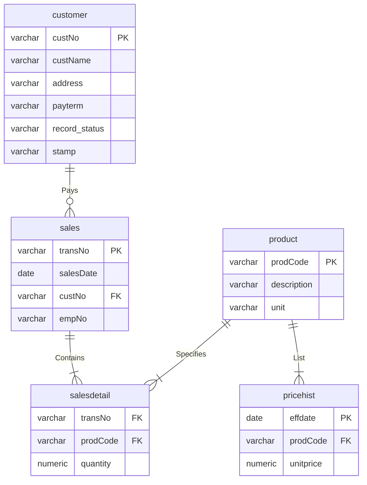

# HopeCMS — Database ERD
## Sprint 1 | M3 SP1 PR Docs
> HOPE, INC

## Relationships
| Relationship |
|===|
| customer → sales |
| sales → salesdetail |
| product → salesdetail |
| product → pricehist |